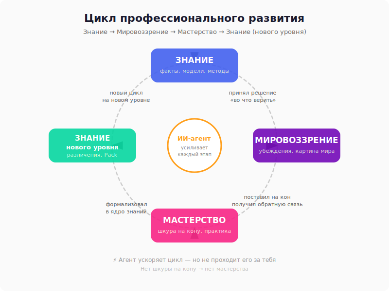

# Знание → Мировоззрение → Мастерство → Знание: цикл, который ИИ не замкнёт за вас

## Провокация

Все говорят: «ИИ знает больше любого эксперта». Это правда — по объёму. Но есть знание, которое невозможно загрузить: **проверенное собственной шкурой**.

Профессионал отличается от начитанного дилетанта не количеством информации, а тем, что он **поставил свои решения на кон** — и получил обратную связь от реальности.

---

## Цикл

Есть четыре состояния, через которые проходит любое профессиональное развитие:

**Знание** → **Мировоззрение** → **Мастерство** → **Знание** (нового уровня)

### 1. Знание (факты, модели, методы)

Ты читаешь книгу, проходишь курс, изучаешь чужой опыт. Это **входящая информация** — она ещё не твоя. Она лежит в голове (или в ChatGPT) как набор фактов.

На этом уровне ИИ действительно сильнее: GPT «прочитал» больше книг, чем ты прочитаешь за жизнь.

### 2. Мировоззрение (картина мира, убеждения, мемы)

Знание становится мировоззрением, когда ты **принимаешь решение**: «я верю, что это работает». Ты выбираешь модель мира. Ты отбрасываешь одни факты и принимаешь другие. Ты создаёшь **свою** систему координат.

Мировоззрение — это фильтр. Два человека с одинаковыми знаниями могут иметь противоположные мировоззрения. Один верит в иерархию, другой — в самоорганизацию. Оба читали одни и те же книги.

ИИ не выбирает мировоззрение. У него нет ставки в игре. Он выдаёт «сбалансированный» ответ — потому что ему нечем рисковать.

### 3. Мастерство (навык, поставленный практикой)

Мировоззрение проверяется **действием**. Ты берёшь свои убеждения и ставишь их на кон: запускаешь проект, принимаешь решение, строишь систему.

Здесь происходит главное — **обратная связь от реальности**:
- Твоя архитектура рухнула под нагрузкой
- Твой метод управления привёл к выгоранию команды
- Твоя стратегия дала x3 к выручке

Мастерство — это знание, оплаченное последствиями. Именно поэтому его нельзя скачать.

ИИ не ставит шкуру на кон. Он не потеряет деньги, если совет окажется плохим. Он не будет не спать ночью, если архитектура развалится. **Нет шкуры на кону — нет мастерства.**

### 4. Знание (нового уровня)

После цикла ты возвращаешься к знанию — но оно уже другое. Это не чужие факты, а **твои различения**: что работает, что нет, при каких условиях. Это знание, которое невозможно получить из книги.

Именно это знание формирует **ядро** — то, что в IWE мы называем Pack.

---

## Где здесь ИИ-агент?

ИИ-агент полезен на **каждом этапе цикла** — но по-разному:

| Этап | Что делает агент | Чего он НЕ делает |
|------|-----------------|-------------------|
| Знание | Находит, систематизирует, объясняет | Не выбирает, что важно *для тебя* |
| Мировоззрение | Проверяет на непротиворечивость, показывает альтернативы | Не принимает решение «во что верить» |
| Мастерство | Автоматизирует рутину, ускоряет итерации | Не несёт последствий, не рискует |
| Знание (новое) | Формализует, хранит, делает переиспользуемым | Не отличает проверенное от правдоподобного |

**Агент — это усилитель цикла, а не замена цикла.**

Он помогает крутить маховик быстрее. Но крутишь его ты.

---

## Pack = ядро знаний профессионала

В IWE есть понятие Pack — **паспорт предметной области**. Это формализованное знание, которое прошло полный цикл:

- Не «что я прочитал» (это входящее знание)
- Не «что я думаю» (это мировоззрение)
- А **«что я проверил и подтвердил практикой»** (это мастерство, ставшее знанием)

Pack формируется в ядре знаний в первую очередь — потому что это самое ценное. Это то, что делает твоего ИИ-помощника *твоим*, а не общим. Без Pack агент работает с энциклопедией. С Pack — с твоей карточкой пациента.

---

## Тест на мастерство

Простой тест: **можешь ли ты объяснить, почему ты выбрал именно это, а не альтернативу?**

- «Потому что так написано в книге» — это знание (уровень 1)
- «Потому что я верю в этот подход» — это мировоззрение (уровень 2)
- «Потому что я пробовал оба, и вот что произошло...» — это мастерство (уровень 3)

ИИ всегда на уровне 1. Он может имитировать уровень 2. Но уровень 3 — только у того, кто **поставил и проверил**.

---

## Вывод

Развитие — это не накопление информации. Это прохождение цикла: узнал → поверил → проверил → понял по-настоящему.

ИИ ускоряет каждый этап, но не проходит цикл за тебя. Профессионал — тот, кто прошёл этот цикл много раз и формализовал результат в ядре знаний.

**Вопрос не в том, сколько знает твой ИИ. Вопрос в том, сколько раз ты замкнул цикл.**

---

> **Связанные черновики:** D-001 (предметное знание и агенты), D-012 (три уровня знаний), D-007 (экзоскелет или протез)
