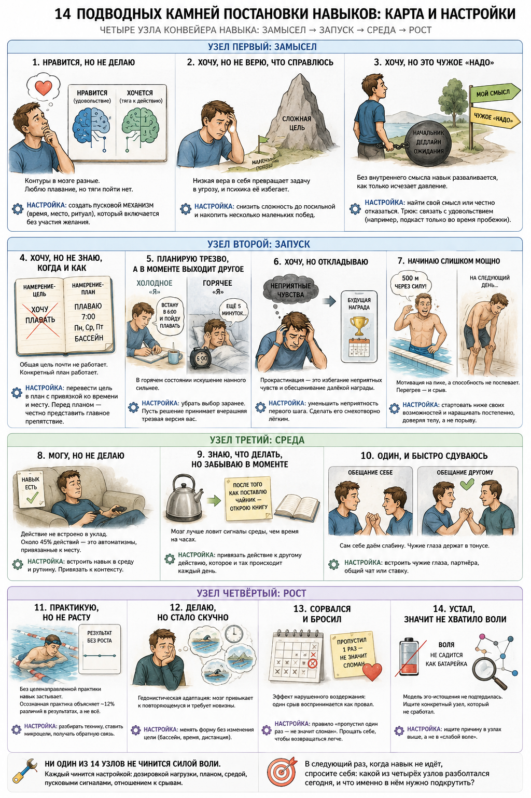

# Что мешает навыку прижиться: карта из 4 узлов и 14 настроек

*Лид-магнит, класс A (массовый). Голос автора: делюсь своей практикой, не учу. Черновик под финальную вычитку Церена.*

---

## Магнит (тело)

Мы почти всегда виним не то. Когда навык не ставится, кажется, что не хватило силы воли, а на деле у пробуксовки бывает добрый десяток разных механизмов, и у каждого свой ключ настройки. Три года назад я вернулся в бассейн, в первый же день проплыл 500 метров через силу, а на следующий день тело отказало, и я не появлялся там две недели. Тогда я решил, что дело в характере. Разобравшись в науке, понял: дело было в одном конкретном перегретом узле, а не в характере целиком.

Навык это не подвиг, а система из четырёх узлов: замысел (хочу ли я это вообще), запуск (превращаю ли хотение в действие сегодня), среда (держится ли действие без ежедневного усилия) и рост (становится ли навык лучше, а не просто регулярнее). Ниже четырнадцать конкретных поломок внутри этих узлов и настройка для каждой.

**Узел первый: замысел**

**1. Нравится, но не делаю.** Удовольствие и мотивация это работа разных систем мозга. Настройка: не ждать порыва, а создать пусковой механизм (время, место, ритуал), который включается без участия желания.

**2. Хочу, но не верю, что справлюсь.** Задача воспринимается как угроза, и психика её избегает. Настройка: снизить сложность до посильной и накопить несколько маленьких побед.

**3. Хочу, но это чужое «надо».** Навык «для галочки» разваливается, как только исчезает внешнее давление. Настройка: найти собственный смысл или честно отказаться. Трюк: связать занятие с удовольствием, которое иначе недоступно.

**Узел второй: запуск**

**4. Хочу, но не знаю, когда и как.** Формула «хочу плавать» почти не работает, а формула «плаваю в семь утра по понедельникам, средам и пятницам» повышает вероятность действия. Настройка: перевести цель в конкретный план с привязкой ко времени и месту.

**5. Планирую трезво, а в моменте выходит другое.** В спокойном состоянии легко недооценить силу будущего искушения. Настройка: убрать выбор заранее, чтобы решение принимала вчерашняя, трезвая версия вас.

**6. Хочу, но откладываю.** Прокрастинация это не лень, а избегание неприятных чувств. Настройка: уменьшить неприятность первого шага, сделать его смехотворно лёгким.

**7. Начинаю слишком мощно.** На пике воодушевления мотивация зашкаливает, а способность за ней не поспевает. Настройка: стартовать ниже своих возможностей и наращивать постепенно.

**Узел третий: среда**

**8. Могу, но не делаю.** Действие не встроено в уклад: около 45% ежедневных действий это автоматизмы, привязанные к месту. Настройка: встроить навык в среду и рутину, привязать к контексту.

**9. Знаю, что делать, но забываю в моменте.** Мозг лучше ловит сигналы среды, чем время на часах. Настройка: привязать действие к другому действию, которое и так происходит каждый день.

**10. Один, и быстро сдуваюсь.** Обещание самому себе слабее обещания, о котором знает кто-то ещё. Настройка: встроить чужие глаза, партнёра, общий чат или ставку.

**Узел четвёртый: рост**

**11. Практикую, но не расту.** Плато автоматизма: без целенаправленной практики навык застывает. Настройка: разбирать технику, ставить микроцели, получать обратную связь.

**12. Делаю, но стало скучно.** Гедонистическая адаптация: мозг привыкает к повторяющемуся и требует новизны. Настройка: менять форму без изменения цели.

**13. Сорвался и бросил.** Один пропуск воспринимается как полный провал, хотя пропуск это статистическая норма любой практики. Настройка: правило «пропустил один раз, не значит сломан».

**14. Устал, значит не хватило воли.** Модель эго-истощения оказалась во многом неверной при повторной проверке. Настройка: искать не исчерпанную волю, а конкретный узел из тринадцати выше.

Ни один из четырнадцати узлов не чинится силой воли. Каждый чинится настройкой. В следующий раз, когда навык не идёт, вопрос не в том, слабый ли вы человек, а в том, какой узел конвейера разболтался сегодня.

---

## Воронка (не часть магнита)

- **CTA (обязателен, nurture-инвариант):** в конце магнита ссылка на Telegram-канал Церена, `https://t.me/systemsthinkinglife`, с обещанием: разбираю на живых примерах, какой узел навыка обычно ломается и как его починить.
- **Следующий шаг цепочки:** через 1-2 касания в канале → приглашение в марафон-бот `https://t.me/aist_me_bot` или в браузерную IWE.
- **Формат-носитель:** карточки в ленте (по одному узлу на карточку, 4 поста) → ссылка на полный магнит.
- **Что проверить перед публикацией:** прочитать вслух (звучит как Церен, не как маркетинг); сверить с `../../style/post.md`. Ссылка на канал подставлена.
- **Источник знания:** полный разбор с именами исследователей и ссылками на источники — в клубном посте `related_post` (см. frontmatter). Здесь — сжатая версия для быстрого захвата.
